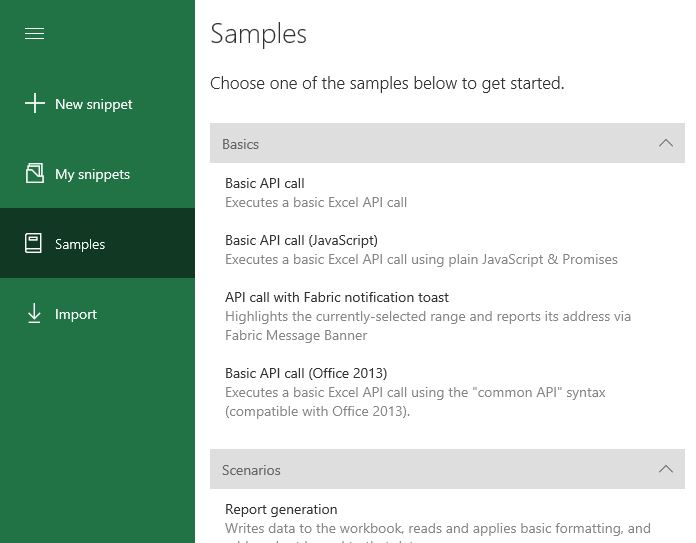

# Office JS Snippets
A growing collection of office.js snippets -- built with [Script Lab](github.com/OfficeDev/script-lab)

## To contribute:
- Fork this repo
- Add samples using the instructions below
- Submit a pull request.

## Folder Structure
- All snippets must be inside the samples folder.
- The `base folders` such as Excel, Word etc. are all the various broad-level categories.
- Inside of each `base folder`, there are `group folders` for the group in which a sample belongs to.
- Inside of each `group folder`, there are `.yaml` which represent a snippet.

## Adding a new sample

Adding a new sample can be done via the website... but if you want a variety of auto-completions to ensure that your snippet doesn't fail the build:
1. Clone the samples repo (or create a branch within the current repo, if you have permissions to it).
2. Ensure you have a recent build of Node [6.10+] (`node -v`). Then install `yarn` as a global package `npm install yarn --global`.
3. Run `yarn install` (similar to `npm install`, but better; and that's what is used by Travis, so best to have the same environment in both places)
4. Create a snippet using [Script Lab](https://github.com/OfficeDev/script-lab/blob/master/README.md#what-is).  Ensure that the name and description are what you want them to be shown publicly.
5. Click on `Copy to Clipboard` in the `Share` menu. 
6. Add that snippet into the respective folders. Make sure that the snippet file names and folder names are in [`kebab-case`](http://wiki.c2.com/?KebabCase).
  - Note: For snippet and group ordering:
    - To order **folders** in a particular way, just add a numeric prefix to the folder name (e.g., "03-range", and the folder will get correctly ordered in the playlist, but have the "03" stripped from any visible place).
    - To order **snippets amongst themselves** in a particular folder, add an "order: <#>" to the top of the snippet file(s). Any snippets with order numbers will be sorted relative to that order.
7. Stage the change.
8. Run `npm start`. If not everything succeeded, inspect the console output to check what validation is failing. Also check the pending changes relative to the staged version, as you may find that the script already substituted in required fields like `id` or `api_set` with reasonable defaults.
9. Re-run `npm start` until the build succeeds.
10. Submit to the repo, and create a merge request into master.

## Style guidelines:

Basic snippet structure is as follows:

    $("#run").click(run);

    async function run() {
        try {
            await Word.run(async (context) => {
                const range = context.document.getSelection();
                range.font.color = "red";

                await context.sync();
            });
        }
        catch (error) {
            OfficeHelpers.Utilities.log(error);
        }
    }

A few style rules to observe:

* Each button-click handler should have its own `async` function, called "run" if there is only one button on the page -- otherwise, name it as you will.
* Inside the function there shall be a try/catch.  In it you will await the `Excel.run` or `Word.run`, and use `async/await` inside of the `.run` as well.
* All HTML IDs should be `all-lower-case-and-hyphenated`.
* Unless you are explicitly showing pretty UI, I wouldn't do the popup notification except for one or two samples.  It's a lot of HTML & JS code, and it's also not strictly Fabric-y (there is a more "correct" way of doing this with components).
* Strings should be in double-quotes.
* Don't forget the semicolons.
* `Libraries` in snippets must have a specific version. Eg. `jquery@3.1.1`.

## Branches

When a snippet is commited into the `master` branch, a Travis-CI build process kicks off to validate the build.  If successful, it  commits the samples & playlist folders into a `deploy-beta` branch, which is used for local and "edge" testing.  For production, a the `prod` and `deploy-prod` branches are used, instead.

## Debugging the build script

* The scripts for building/validating the snippets are under the `config` folder -- in particular, under `build.ts`. There is also a `deploy.ts` for copying the built files to their final location.)

>> **NOTE**: If debugging in Visual Studio Code, you can use "F5" to attach the debugger, but be sure to run `npm run tsc` before you do (and after any code change!). `F5` is not set to recompile!
